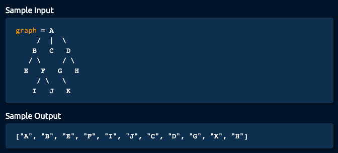

# Algorithm practice

* Java documentations and extra notes are in each file.
* Solutions displayed here are preferably the most optimal
    * Alternative (less optimal) solutions might also be available within each 
    file

# Week 13: 08/02 - 08/08/2021

# Category for this week:
**[Graph](#graph)**<br>

---

# Graph

## [Depth-first Search](../Graph/src/main/java/DepthFirstSearch.java)

#### Level: Easy 📗

> You're given a `Node` class that has a `name` and an array of optional `children` nodes. When put together, nodes form an acyclic tree-like structure.
>
> Implement the `depthFirstSearch` method on the `Node` class, which takes in an empty array, traverses the tree using the Depth-first Search approach (specifically navigating the tree from left to right), stores all of the nodes' names in the input array, and returns it.



```java
public List<String> depthFirstSearch(List<String> array) {
  array.add(this.name);
  for (Node child : children) {
    child.depthFirstSearch(array);
  }
  return array;
}
```

### O(v + e) time | O(v) space - v is number of vertices, e is number of edges

