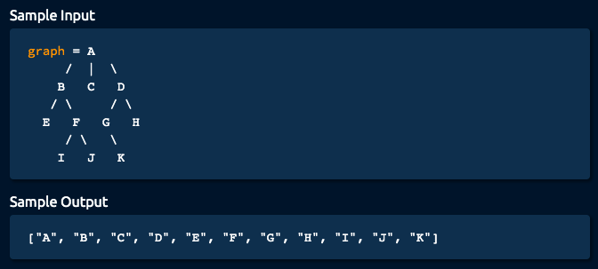

# Algorithm practice

* Java documentations and extra notes are in each file.
* Solutions displayed here are preferably the most optimal
    * Alternative (less optimal) solutions might also be available within each 
    file

# Week 13: 08/02 - 08/08/2021

# Category for this week:
**[Graph](#graph)**<br>

---

# Graph

## [Depth-first Search](../Graph/src/main/java/DepthFirstSearch.java)

#### Level: Easy 📗

> You're given a `Node` class that has a `name` and an array of optional `children` nodes. When put together, nodes form an acyclic tree-like structure.
>
> Implement the `depthFirstSearch` method on the `Node` class, which takes in an empty array, traverses the tree using the Depth-first Search approach (specifically navigating the tree from left to right), stores all of the nodes' names in the input array, and returns it.


```java
static class Node {

  String name;
  List<Node> children = new ArrayList<Node>();

  public Node(String name) {
    this.name = name;
  }

  public Node addChild(String name) {
    Node child = new Node(name);
    children.add(child);
    return this;
  }

  public List<String> depthFirstSearch(List<String> array) {
    array.add(this.name);
    for (Node child : children) {
      child.depthFirstSearch(array);
    }
    return array;
  }

}
```

### O(v + e) time | O(v) space - v is number of vertices, e is number of edges

## [Breadth-first Search](../Graph/src/main/java/BreadthFirstSearch.java)

#### Level: Medium 📘

> You're given a `Node` class that has a `name` and an array of optional `children` nodes. When put together, nodes form an acyclic tree-like structure.
>
> Implement the `breadthFirstSearch` method on the `Node` class, which takes in an empty array, traverses the tree using the Breadth-first Search approach (specifically navigating the tree from left to right), stores all of the nodes' names in the input array, and returns it.



```java
static class Node {

  String name;
  List<Node> children = new ArrayList<Node>();

  public Node(String name) {
    this.name = name;
  }

  public Node addChild(String name) {
    Node child = new Node(name);
    children.add(child);
    return this;
  }

  public List<String> breadthFirstSearch(List<String> array) {
      List<Node> queue = new ArrayList<>();
      queue.add(this);
      while (!queue.isEmpty()) {
        Node currNode = queue.remove(0);
        array.add(currNode.name);
        queue.addAll(currNode.children);
      }
      return array;
    }

}
```

### O(v + e) time | O(v) space - v is number of vertices, e is number of edges

## [Single Cycle Check](../Graph/src/main/java/SingleCycleCheck.java)

#### Level: Medium 📘

> You're given an array of integers where each integer represents a jump of its value in the array. For instance, the integer `2` represents a jump of two indices forward in the array; the integer `-3` represents a jump of three indices backward in the array.
>
> If a jump spills past the array's bounds, it wraps over to the other side. For instance, a jump of `-1` at index `0` brings us to the last index in the array. Similarly, a jump of `1` at the last index in the array brings us to index `0`.
> Write a function that returns a boolean representing whether the jumps in the array form a single cycle. A single cycle occurs if, starting at any index in the array and following the jumps, every element in the array is visited exactly once before landing back on the starting index.

```java
public static boolean hasSingleCycle(int[] array) {
  int counter = 0;
  int idx = 0;
  while (counter < array.length) {
    if (counter > 0 && idx == 0) {
      return false;
    }
    int numMoves = array[idx];
    idx = validateMove(numMoves, idx, array.length);
    counter++;
  }
  return idx == 0;
}

public static int validateMove(int numMoves, int idx, int arrayLength) {
  int newIdx = (idx + numMoves) % arrayLength;
  return newIdx >= 0 ? newIdx : newIdx + arrayLength;
}
```

### O(n) time | O(1) space