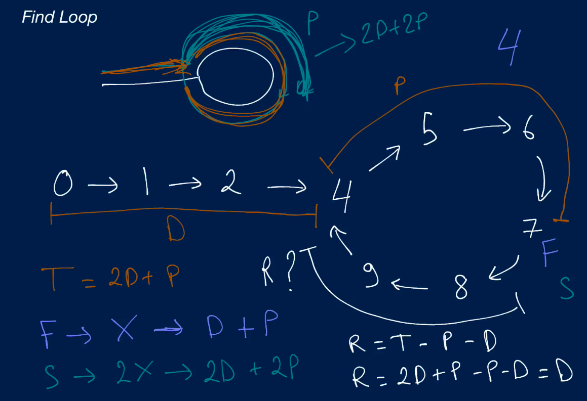

# Algorithm practice

* Java documentations and extra notes are in each file.
* Solutions displayed here are preferably the most optimal
    * Alternative (less optimal) solutions might also be available within each 
    file

# Week 14: 08/30 - 09/05/2021

# Category for this week:
**[Linked List](#linked-list)**<br>

---

# Linked List

## [Sum Of Linked Lists](../LinkedList/src/main/java/SumOfLinkedList.java)
* Similar to to Leetcode #2 - add 2 numbers (from week 5)

#### Level: Medium 📘

> You're given two Linked Lists of potentially unequal length. Each Linked List represents a non-negative integer, where each node in the Linked List is a digit of that integer, and the first node in each Linked List always represents the least significant digit of the integer. Write a function that returns the head of a new Linked List that represents the sum of the integers represented by the two input Linked Lists.
>
> Each `LinkedList` node has an integer `value` as well as a `next` node pointing to the next node in the list or to `None` / `null` if it's the tail of the list. The `value` of each `LinkedList` node is always in the range of `0 - 9`.
>
> Note: your function must create and return a new Linked List, and you're not allowed to modify either of the input Linked Lists.

```java
// This is an input class. Do not edit.
public static class LinkedList {
  public int value;
  public LinkedList next;

  public LinkedList(int value) {
    this.value = value;
    this.next = null;
  }
}

public LinkedList sumOfLinkedLists(LinkedList linkedListOne, LinkedList linkedListTwo) {
  LinkedList newHead = new LinkedList(0), currNode = newHead;
  int needAdd1 = 0;
  while (linkedListOne != null || linkedListTwo != null || needAdd1 != 0) {
    int val1 = 0, val2 = 0;
    if (linkedListOne != null) {
      val1 = linkedListOne.value;
      linkedListOne = linkedListOne.next;
    }
    if (linkedListTwo != null) {
      val2 = linkedListTwo.value;
      linkedListTwo = linkedListTwo.next;
    }
    int currSum = val1 + val2 + needAdd1;
    int newValue = currSum % 10; // divmod in python would save 2 lines
    needAdd1 = currSum / 10;
    currNode.next = new LinkedList(newValue);
    currNode = currNode.next;
  }
  return newHead.next;
}
```

### O(max(n1,n2)) time | O(max(n1,n2)) space

## [Find Loop](../LinkedList/src/main/java/FindLoop.java)

#### Level: Hard 📕

> Write a function that takes in the head of a Singly Linked List that contains a loop (in other words, the list's tail node points to some node in the list instead of `None` / `null`). The function should return the node (the actual node--not just its value) from which the loop originates in constant space.
> Each `LinkedList` node has an integer `value` as well as a `next` node pointing to the next node in the list.

### Conceptual Visualization



```java
public static LinkedList findLoop(LinkedList head) {
  LinkedList slowPtr = head.next;
  LinkedList fastPtr = head.next.next;
  while (slowPtr != fastPtr) {
    slowPtr = slowPtr.next;
    fastPtr = fastPtr.next.next;
  }
  slowPtr = head;
  while (slowPtr != fastPtr) {
    slowPtr = slowPtr.next;
    fastPtr = fastPtr.next;
  }
  return slowPtr;
}
```

### O(n) time | O(1) space

## [Reverse Linked List](../LinkedList/src/main/java/ReverseLinkedList.java)

#### Level: Hard 📕

> Write a function that takes in the head of a Singly Linked List, reverses the list in place (i.e., doesn't create a brand new list), and returns its new head.
>
> Each `LinkedList` node has an integer `value` as well as a `next` node pointing to the next node in the list or to `None` / `null` if it's the tail of the list.
>
> You can assume that the input Linked List will always have at least one node; in other words, the head will never be `None` / `null`.

```java
public static LinkedList reverseLinkedList(LinkedList head) {
  Stack<Integer> stack = new Stack<Integer>();
  LinkedList currNode = head;
  while (currNode != null) {
    stack.push(currNode.value);
    currNode = currNode.next;
  }
  currNode = head;
  while (!stack.empty()) {
    currNode.value = stack.pop();
    currNode = currNode.next;
  }
  return head;
}
```

### O(2n) -> O(n) time | O(n) space