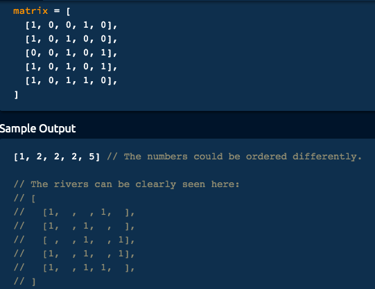

# Algorithm practice

* Java documentations and extra notes are in each file.
* Solutions displayed here are preferably the most optimal
    * Alternative (less optimal) solutions might also be available within each 
    file

# Week 16: 09/20 - 09/26/2021

# Category for this week:
**[Searching](#searching)**<br>
**[Graph](#graph)**<br>

---

# Searching

## [Leetcode #33 - Search In Rotated Sorted Array](https://leetcode.com/problems/search-in-rotated-sorted-array/)

#### Level: Medium 📘

```python
def search(self, nums, target):
    # min or max range: no
    # negavtive num: no
    # asceding, descending: depends
    # consider float or null cases
    # 1, 2, 3, 4, 5, 6
    # 4, 5, 6, 7, 0, 1, 2
    '''
    Test cases
    1. [1,2,3,4,5,6], target = 4
    return 3
    
    2. [4,5,6,7,0,1,2] target = 4
    return 0
    
    3. [1] target = 0
    return -1
    
    4. [] target = 0
    return -1
    '''
    if not nums:
        return -1
    start = 0
    end = len(nums) - 1
    while start <= end:
        mid = (end - start) / 2 + start
        if nums[mid] == target:
            return mid
        
        if nums[start] <= nums[mid]: # pivot at left side
            if nums[start] <= target and target <= nums[mid]:
                end = mid - 1
            else:
                start = mid + 1
        else: # pivot at right side
            if nums[mid] <= target and target <= nums[end]:
                start = mid + 1
            else: 
                end = mid - 1
    return -1
```

### O(log n) time | O(1) space

---

# Graph

## [River Sizes](../Graph/src/main/java/RiverSizes.java)
* DFS approach

#### Level: Medium 📘

> You're given a two-dimensional array (a matrix) of potentially unequal height and width containing only `0`s and `1`s. Each `0` represents land, and each `1` represents part of a river. A river consists of any number of `1`s that are either horizontally or vertically adjacent (but not diagonally adjacent). The number of adjacent `1`s forming a river determine its size.
>
> Note that a river can twist. In other words, it doesn't have to be a straight vertical line or a straight horizontal line; it can be L-shaped, for example.
>
> Write a function that returns an array of the sizes of all rivers represented in the input matrix. The sizes don't need to be in any particular order.



```java
public static List<Integer> riverSizes(int[][] matrix) {
    List<Integer> sizes = new ArrayList<>();
    boolean[][] visited = new boolean[matrix.length][matrix[0].length];
    for (int i = 0; i < matrix.length; i++) {
      for (int j = 0; j < matrix[0].length; j++) {
        if (visited[i][j]) {
          continue;
        }
        traverseNode(i, j, matrix, visited, sizes);
      }
    }
    return sizes;
  }

  public static void traverseNode(int i, int j, int[][] matrix, boolean[][] visited,
      List<Integer> sizes) {
    int currRiverSize = 0;
    Stack<Integer[]> nodesToExplore = new Stack<Integer[]>();
    nodesToExplore.push(new Integer[]{i, j});
    while (!nodesToExplore.empty()) {
      Integer[] currNode = nodesToExplore.pop();
      i = currNode[0];
      j = currNode[1];
      if (visited[i][j]) {
        continue;
      }
      visited[i][j] = true;
      if (matrix[i][j] == 0) {
        continue;
      }
      currRiverSize++;
      List<Integer[]> unvisitedNeighbors = getUnvisitedNeighbors(i, j, matrix, visited);
      for (Integer[] neighbor : unvisitedNeighbors) {
        nodesToExplore.add(neighbor);
      }
    }
    if (currRiverSize > 0) {
      sizes.add(currRiverSize);
    }
  }

  public static List<Integer[]> getUnvisitedNeighbors(int i, int j, int[][] matrix,
      boolean[][] visited) {
    List<Integer[]> unvisitedNeighbors = new ArrayList<Integer[]>();
    if (i > 0 && !visited[i - 1][j]) { // node above
      unvisitedNeighbors.add(new Integer[]{i - 1, j});
    }
    if (i < matrix.length - 1 && !visited[i + 1][j]) { // node below
      unvisitedNeighbors.add(new Integer[]{i + 1, j});
    }
    if (j > 0 && !visited[i][j - 1]) { // node on left
      unvisitedNeighbors.add(new Integer[]{i, j - 1});
    }
    if (j < matrix[0].length - 1 && !visited[i][j + 1]) { // node on right
      unvisitedNeighbors.add(new Integer[]{i, j + 1});
    }
    return unvisitedNeighbors;
  }
```

### O(wh) time | O(wh) space - where w and h are the width and height of the input matrix
