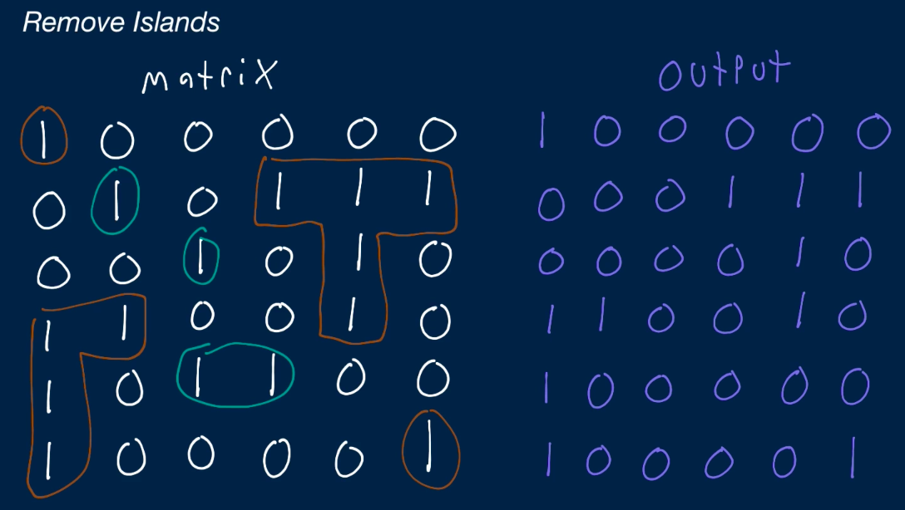

# Algorithm practice

# Week 22: 10/25 - 10/31/2021

# Category for this week:
**[Graph](#graph)**<br>

> These non-leetcode problems are usually in Java, switch to Python for now

---

# Graph

## [Youngest Common Ancestor]()

#### Level: Medium 📘

> You're given three inputs, all of which are instances of an `AncestralTree` class that have an `ancestor` property pointing to their youngest ancestor. The first input is the top ancestor in an ancestral tree (i.e., the only instance that has no ancestor--its `ancestor` property points to `None` / `null`), and the other two inputs are descendants in the ancestral tree.
>
> Write a function that returns the youngest common ancestor to the two descendants.
>
> Note that a descendant is considered its own ancestor. So in the simple ancestral tree below, the youngest common ancestor to nodes A and B is node A.

```python
# This is an input class. Do not edit.
class AncestralTree:
  def __init__(self, name):
    self.name = name
    self.ancestor = None


def getYoungestCommonAncestor(topAncestor, descendantOne, descendantTwo):
  depthOne = getDescendantDepth(descendantOne, topAncestor)
	depthTwo = getDescendantDepth(descendantTwo, topAncestor)
	if depthOne > depthTwo:
		return backtrackAncestralTree(descendantOne, descendantTwo, depthOne - depthTwo)
	return backtrackAncestralTree(descendantTwo, descendantOne, depthTwo - depthOne)

def getDescendantDepth(descendant, topAncestor):
	depth = 0
	while descendant != topAncestor:
		depth += 1
		descendant = descendant.ancestor
	return depth

def backtrackAncestralTree(lowerDescendant, higherDescendant, diff):
	while diff > 0:
		diff -= 1
		lowerDescendant = lowerDescendant.ancestor
	while lowerDescendant != higherDescendant:
		lowerDescendant = lowerDescendant.ancestor
		higherDescendant = higherDescendant.ancestor
	return lowerDescendant
```

### O(d) time | O(1) space - d means depth/ height of ancestral tree

## [Remove Islands]()

#### Level: Medium 📘

> You're given a two-dimensional array (a matrix) of potentially unequal height and width containing only `0`s and `1`s. The matrix represents a two-toned image, where each `1` represents black and each `0` represents white. An island is defined as any number of `1`s that are horizontally or vertically adjacent (but not diagonally adjacent) and that don't touch the border of the image. In other words, a group of horizontally or vertically adjacent `1`s isn't an island if any of those `1`s are in the first row, last row, first column, or last column of the input matrix.
> Note that an island can twist. In other words, it doesn't have to be a straight vertical line or a straight horizontal line; it can be L-shaped, for example.
> You can think of islands as patches of black that don't touch the border of the two-toned image.
> Write a function that returns a modified version of the input matrix, where all of the islands are removed. You remove an island by replacing it with `0`s.
> Naturally, you're allowed to mutate the input matrix.



```python
def removeIslands(matrix):
  onesConnectedToBorder = [[False for value in row] for row in matrix]
	
	for row in range(len(matrix)):
		for col in range(len(matrix[0])):
			rowIsBorder = row == 0 or row == len(matrix) - 1
			colIsBorder = col == 0 or col == len(matrix[0]) - 1
			isBorder = rowIsBorder or colIsBorder
			if not isBorder:
				continue
			if matrix[row][col] != 1:
				continue
			# DFS
			findOnesConnectedToBorder(matrix, row, col, onesConnectedToBorder)
		
	# Don't need to check the border - 1 to (length - 1)
	for row in range(1, len(matrix) - 1):
		for col in range(1, len(matrix[0]) - 1):
			if onesConnectedToBorder[row][col]:
				continue
			matrix[row][col] = 0
    return matrix

def findOnesConnectedToBorder(matrix, startRow, startCol, onesConnectedToBorder):
	stack = [[startRow, startCol]]
	while stack:
		currPosition = stack.pop()
		currRow = currPosition[0]
		currCol = currPosition[1]
		if onesConnectedToBorder[currRow][currCol]: # visited
			continue
		onesConnectedToBorder[currRow][currCol] = True
		neighbors = getNeighbors(matrix, currRow, currCol)
		for neighbor in neighbors:
			row, col = neighbor[0], neighbor[1]
			if matrix[row][col] != 1:
				continue
			stack.append(neighbor)
			
def getNeighbors(matrix, row, col):
	neighbors = []
	if row - 1 >= 0: # Up
		neighbors.append([row - 1, col])
	if row + 1 < len(matrix): # Down
		neighbors.append([row + 1, col])
	if col - 1 >= 0: # Left
		neighbors.append([row, col - 1])
	if col + 1 < len(matrix[0]): # Right
		neighbors.append([row, col + 1])
	return neighbors
```

### O(wh) time | O(wh) space - w is width and h is height of matrix
