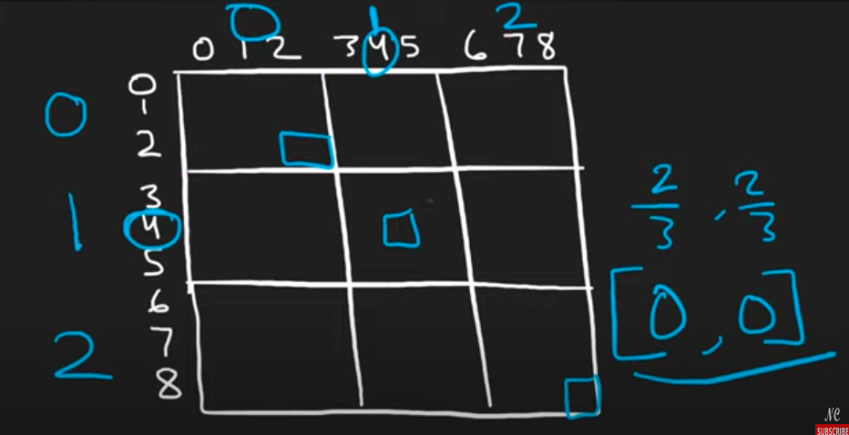

# Algorithm practice

# Week 05/08 - 05/14/2023


# Category for this week:
**[Array](#array)**<br>

---

# Array

## [Leetcode #36 - Valid Sudoku](https://leetcode.com/problems/valid-sudoku/)

#### Level: Medium 📘

Old approach
```python
def isValidSudoku(self, board):
  """
  :type board: List[List[str]]
  :rtype: bool
  
  Test case:
  1. Valid sudoku
  2. Invalid one
  3. Null
  
  Approach: 
  Array: 1,2,3,4,5
  String: 12345 -> parse thru the whole string -> not good
  HashMap - HashSet: b/c complexity to look up O(1)
  """
  storing_set = set()
  for row_idx in range(len(board)):
    for col_idx in range(len(board[0])):
      val = board[row_idx][col_idx]
      if val == ".":
        continue
      row_val = val + "row" + str(row_idx)
      col_val = val + "col" + str(col_idx)
      sub_matrix_val = val + "sub" + str(row_idx // 3) + str(col_idx // 3)
      if row_val in storing_set or col_val in storing_set or sub_matrix_val in \
        storing_set:
        return False
      storing_set.add(row_val)
      storing_set.add(col_val)
      storing_set.add(sub_matrix_val)
  return True
```

New approach
```python
def isValidSudoku(self, board):
  """
  :type board: List[List[str]]
  :rtype: bool
  """
  cols = collections.defaultdict(set)
  rows = collections.defaultdict(set)
  squares = collections.defaultdict(set)  # key = (r /3, c /3)

  for r in range(len(board)): # len = 9 
    for c in range(len(board[0])): # len = 9
      val = board[r][c]
      if val == ".":
        continue
      if (
        val in rows[r]
        or val in cols[c]
        or val in squares[(r // 3, c // 3)]
      ):
        return False
      cols[c].add(val)
      rows[r].add(val)
      squares[(r // 3, c // 3)].add(val)
  return True
```

### O(n^2) time | O(n^2) space - because must loop thru every element in matrix
### Which is O(9^2) time and O(9^2) space

For sub_matrix_value, the sudoku is divided into big squares - 3 squares instead of 9



## [Leetcode #659 - Encode and Decode String](https://leetcode.com/problems/encode-and-decode-strings/)
> Premium

#### Level: Medium 📘

```python
class Solution:

  def encode(self, strs):
    """
    @param: strs: a list of strings
    @return: encodes a list of strings to a single string.
    """
    res = ""
    for s in strs:
      res += str(len(s)) + "#" + s
    return res

  def decode(self, s):
    """
    @param: s: A string
    @return: decodes a single string to a list of strings
    """
    res, i = [], 0
    while i < len(s):
      j = i
      while s[j] != "#":
        j += 1
      length = int(s[i:j])
      res.append(s[j + 1 : j + 1 + length])
      i = j + 1 + length
    return res
```

### O(m) time | O(n) space - m is total number of char in all strings, n is number of items in list

## [Leetcode #128 - Longest Consecutive Sequence](https://leetcode.com/problems/longest-consecutive-sequence/)

#### Level: Medium 📘

```python
def longestConsecutive(self, nums):
  """
  :type nums: List[int]
  :rtype: int
  """
  if not nums:
    return 0

  nums = sorted(nums)
  prevNum, currCount, maxCount = nums[0], 1, 1
  for num in nums[1:]:
    if num == prevNum:
      continue
    if num - prevNum == 1:
      currCount += 1
    else:
      currCount = 1
    prevNum = num
    maxCount = max(currCount, maxCount)
  return maxCount
```

### O(nlogn) time | O(3) = O(1) space

```python
def longestConsecutive(self, nums):
  """
  :type nums: List[int]
  :rtype: int
  """
  if not nums:
    return 0
  
  maxCount = 0
  nums = set(nums)
  for num in nums:
    # check if num is the start of a sequence
    if num - 1 not in nums:
      currCount = 0
      while num + currCount in nums:
        currCount += 1
      maxCount = max(maxCount, currCount)
  return maxCount
```

### O(n) time | O(n) space if we're not allowed to modify nums, O(1) if we're allowed
