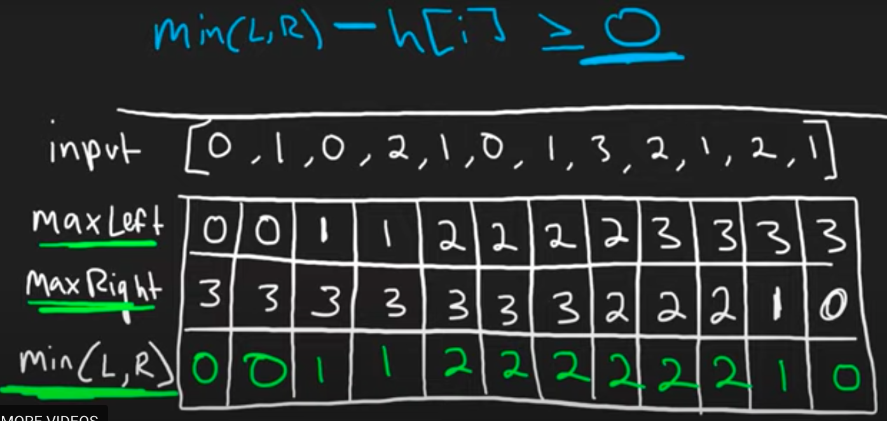

# Algorithm practice

# Week 05/15 - 05/21/2023


# Category for this week:
**[Two Pointers](#two~pointers)**<br>

---

# Two Pointers

## [Leetcode #125 - Valid Palindrome](https://leetcode.com/problems/valid-palindrome/)

#### Level: Easy 📗

```python
def isPalindrome(self, s):
  """
  :type s: str
  :rtype: bool
  """
  leftPtr = 0
  rightPtr = len(s) - 1
  if leftPtr >= rightPtr:
    return True

  while leftPtr < rightPtr:
    leftChar = s[leftPtr].lower()
    rightChar = s[rightPtr].lower() 
    if not leftChar.isalnum():
      leftPtr += 1
    elif not rightChar.isalnum():
      rightPtr -= 1
    else:
      if leftChar != rightChar:
        return False
      leftPtr += 1
      rightPtr -= 1
  return True
```

### O(n) time | O(1) space

## [Leetcode #167 - Two Sum II - Input Array Is Sorted](https://leetcode.com/problems/two-sum-ii-input-array-is-sorted/)

#### Level: Medium 📘

```python
def twoSum(self, numbers, target):
  """
  :type numbers: List[int]
  :type target: int
  :rtype: List[int]
  """
  leftPtr, rightPtr = 0, len(numbers) - 1
  while leftPtr < rightPtr:
    val = numbers[leftPtr], numbers[rightPtr]
    if val > target:
      rightPtr -= 1
    elif val < target:
      leftPtr += 1
    else:
      return [leftPtr + 1, rightPtr + 1]
```

### O(n) time | O(1) space


## [Leetcode #15 - 3Sum](https://leetcode.com/problems/3sum/)

#### Level: Medium 📘

```python
def threeSum(self, nums):
  """
  :type nums: List[int]
  :rtype: List[List[int]]
  """
  TARGET = 0

  result = []
  nums.sort()

  for i, num in enumerate(nums):
    # only count the FIRST appearance of repeated number
    # the rest repetition will be ignored
    if i > 0 and num == nums[i - 1]:
      continue

    leftPtr, rightPtr = i + 1, len(nums) - 1
    while leftPtr < rightPtr:
      threeSum = num + nums[leftPtr] + nums[rightPtr]
      if threeSum > TARGET:
        rightPtr -= 1
      elif threeSum < TARGET:
        leftPtr += 1
      else:
        result.append([num, nums[leftPtr], nums[rightPtr]])
        leftPtr += 1
        while nums[leftPtr] == nums[leftPtr - 1] and leftPtr < rightPtr:
          leftPtr += 1
              
  return result
```

### O(n^2) time - from O(nlogn) + O(n^2) | O(1) space - in some libraries, sorting might store additional memory, which could result in O(n) space due to sort()

## [Leetcode #11 - Container With Most Water](https://leetcode.com/problems/container-with-most-water/)

#### Level: Medium 📘

```python
def maxArea(self, height):
  """
  :type height: List[int]
  :rtype: int
  """
  maxArea = 0
  leftWall, rightWall = 0, len(height) - 1
  while leftWall != rightWall:
    currArea = min(height[leftWall], height[rightWall]) * (rightWall - leftWall)
    maxArea = max(maxArea, currArea)
    if height[leftWall] < height[rightWall]:
      leftWall += 1
    else:
      rightWall -= 1
  return maxArea
```

### O(n) time | O(1) space - n is number of elements in the list (height)

## [Leetcode #42 - Trapping Rain Water](https://leetcode.com/problems/container-with-most-water/)

#### Level: Hard 📕

> O(n) memory allocation
> IMPORTANT: The formula is min(L, R) - height[i] to get trapped water at i



```python
def trap(self, height):
  """
  :type height: List[int]
  :rtype: int
  """
  size = len(height)

  leftMax = [0 for i in range(size)]
  rightMax = [0 for i in range(size)]
  runningLeftMax, runningRightMax = 0, 0

  for i, num in enumerate(height):
    leftMax[i] = runningLeftMax
    runningLeftMax = max(runningLeftMax, num)

  for i in range(size - 1, -1, -1):
    rightMax[i] = runningRightMax
    runningRightMax = max(runningRightMax, height[i])

  result = 0
  for i, num in enumerate(height):
    trappedWater = min(leftMax[i], rightMax[i]) - num
    if trappedWater > 0:
      result += trappedWater

  return result
```

### O(n) time | O(n) space
