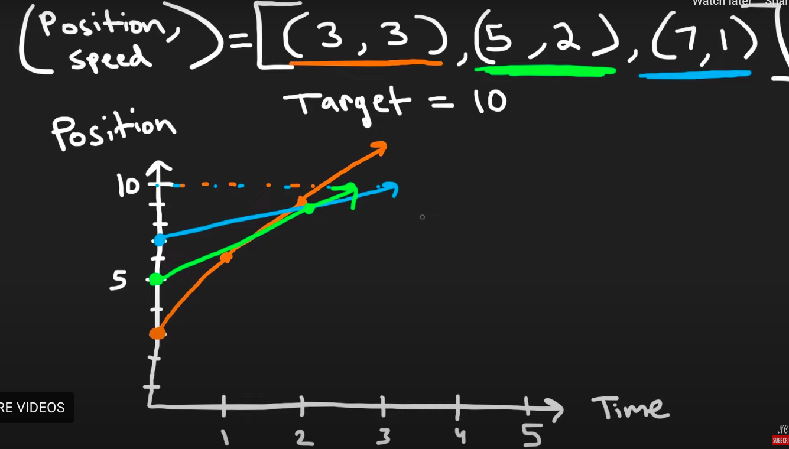

# Algorithm practice

# Week 05/22 - 05/28/2023


# Category for this week:
**[Stack](#stack)**<br>

---

# Stack

## [Leetcode #739 - Daily Temperatures](https://leetcode.com/problems/daily-temperatures/)

#### Level: Medium 📘

```python
def dailyTemperatures(self, temperatures):
  """
  :type temperatures: List[int]
  :rtype: List[int]
  """
  answer =[0 for i in range(len(temperatures))]
  stack = []
  for i in range(len(temperatures)):
    while stack and temperatures[i] > temperatures[stack[-1]]:
      prev_index = stack.pop()
      answer[prev_index] = i - prev_index
    stack.append(i)
  return answer
```

### O(n) time | O(n) space


## [Leetcode #853 - Car Fleet](https://leetcode.com/problems/car-fleet/)

#### Level: Medium 📘

Linear equation -> intersection



> Success run on Python3

```python
def carFleet(self, target: int, position: List[int], speed: List[int]) -> int:
  pair = [(p, s) for p, s in zip(position, speed)]
  pair.sort(reverse=True)
  stack = []
  for p, s in pair:  # Reverse Sorted Order
    stack.append((target - p) / s)
    if len(stack) >= 2 and stack[-1] <= stack[-2]:
      stack.pop()
  return len(stack)
```

### O(n log(n)) time | O(n) space

## [Leetcode #84 - Largest Rectangle in Histogram](https://leetcode.com/problems/largest-rectangle-in-histogram/)

#### Level: Hard 📕

```python
def largestRectangleArea(self, heights: List[int]) -> int:
  maxArea = 0
  stack = []  # pair: (index, height)

  for i, h in enumerate(heights):
    start = i
    while stack and stack[-1][1] > h:
      index, height = stack.pop()
      maxArea = max(maxArea, height * (i - index))
      start = index
    stack.append((start, h))

  for i, h in stack:
    maxArea = max(maxArea, h * (len(heights) - i))
  return maxArea
```
