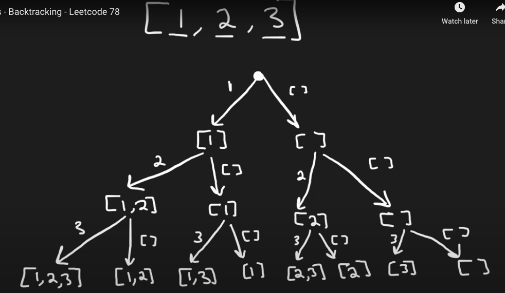

# Algorithm practice

# Week 07/03 - 07/09/2023


# Category for this week:
**[Tries](#tries)**<br>
**[Backtracking](#backtracking)**<br>

---

# Tries

## [Leetcode #208 - Implement Trie (Prefix Tree)](https://leetcode.com/problems/implement-trie-prefix-tree/)

#### Level: Medium 📘

```python
class TrieNode(object):
  def __init__(self):
    self.children = {}
    self.endOfWord = False

class Trie(object):

  def __init__(self):
    self.root = TrieNode()

  def insert(self, word):
    """
    :type word: str
    :rtype: None
    """
    curr = self.root
    for c in word:
      if c not in curr.children:
        curr.children[c] = TrieNode()
      curr = curr.children[c]
    curr.endOfWord = True
      
  def search(self, word):
    """
    :type word: str
    :rtype: bool
    """
    curr = self.root
    for c in word:
      if c not in curr.children:
        return False
      curr = curr.children[c]
    return curr.endOfWord

  def startsWith(self, prefix):
    """
    :type prefix: str
    :rtype: bool
    """
    curr = self.root
    for c in prefix:
      if c not in curr.children:
        return False
      curr = curr.children[c]
    return True
```

### O(n) time - n is number of characters in word/prefix

## [Leetcode #211 - Design Add and Search Words Data Structure](https://leetcode.com/problems/design-add-and-search-words-data-structure/)

#### Level: Medium 📘

```python
class Node(object):
  def __init__(self):
    self.children = {}
    self.endOfWord = False


class WordDictionary(object):
  def __init__(self):
    self.root = Node()
      
  def addWord(self, word):
    """
    :type word: str
    :rtype: None
    """
    node = self.root
    for c in word:
      if c not in node.children:
        node.children[c] = Node()
      node = node.children[c]
    node.endOfWord = True

  def search(self, word):
    """
    :type word: str
    :rtype: bool
    """

    def dfs(startIdx, startNode):
      curr = startNode
      for idx in range(startIdx, len(word)):
        char = word[idx]
        if char == ".":
          # iterate through all children
          for children in curr.children.values():
            if dfs(idx + 1, children):
              return True
          # no children matches
          return False
        else:
          if char not in curr.children:
            return False
          curr = curr.children[char]
      return curr.endOfWord

    return dfs(0, self.root)
```

### O(n) time - n is number of characters in word/prefix

## [Leetcode #212. Word Search II](https://leetcode.com/problems/word-search-ii/)

#### Level: Hard 📕

```python
class TrieNode(object):
  def __init__(self):
    self.children = {}
    self.endOfWord = False
      
  def addWord(self, word):
    curr = self
    for c in word:
      if c not in curr.children:
        curr.children[c] = TrieNode()
      curr = curr.children[c]
    curr.endOfWord = True

class Solution(object):
  def findWords(self, board, words):
    """
    :type board: List[List[str]]
    :type words: List[str]
    :rtype: List[str]
    """
    root = TrieNode()
    for w in words:
      root.addWord(w)
        
    ROWS, COLS = len(board), len(board[0])
    result, visited = set(), set()
    
    def dfs(r, c, node, word):
      if r < 0 or c < 0 or r >= ROWS or c >= COLS or (r, c) in visited or board[r][c] not in node.children:
        return
      visited.add((r, c))
      node = node.children[board[r][c]]
      word += board[r][c]
      if node.endOfWord:
        result.add(word)

      dfs(r - 1, c, node, word)
      dfs(r + 1, c, node, word)
      dfs(r, c - 1, node, word)
      dfs(r, c + 1, node, word)
      
      visited.remove((r, c))
        
    for r in range(ROWS):
        for c in range(COLS):
            dfs(r, c, root, "")
    
    return list(result) # used set for result b/c list might contain duplicate
```

### O(n * m * 4^n) time | O(w) space - w is number of characters of all words

---

# Backtracking

## [Leetcode #78 - Subsets](https://leetcode.com/problems/subsets/)

#### Level: Medium 📘



```python
def subsets(self, nums: List[int]) -> List[List[int]]:
  result = []
  subset = []

  def dfs(i):
    if i >= len(nums): # done iterating
      result.append(subset.copy()) # copy to get the global variable, other subset is just []
      return
    
    # decision to include nums[i] - left side
    subset.append(nums[i])
    dfs(i + 1)

    # decision NOT to include nums[i] - right side
    subset.pop()
    dfs(i + 1)

  dfs(0)
  return result
```

### O(n * 2^n) time | O(2^n) space

## [Leetcode #39 - Combination Sum](https://leetcode.com/problems/combination-sum/)

#### Level: Medium 📘


> Brute force approach

```python
def combinationSum(self, candidates, target):
  """
  :type candidates: List[int]
  :type target: int
  :rtype: List[List[int]]
  """
  result = []

  def dfs(subset):
    sumSubset = sum(subset)
    if sumSubset == target:
      subset.sort()
      if subset not in result:
        result.append(subset)
      return
    if sumSubset > target:
      return
    else:
      for num in candidates:
        dfs(subset + [num])
  
  for num in candidates:
    dfs([num])

  return result
```

### O(2^target) time | O(target) space

> Optimized

```python
def combinationSum(self, candidates: List[int], target: int) -> List[List[int]]:
  result = []
  
  # backtracking approach
  def dfs(i, currCombination, total):
    if total == target:
      result.append(currCombination.copy()) # we will continue to use itit below
      return
    if i >= len(candidates) or total > target:
      return
      
    # create 2 branches, to avoid DUPLICATED combination
    currCombination.append(candidates[i]) # including curr number
    dfs(i, currCombination, total + candidates[i])
    currCombination.pop() # exclude curr number
    dfs(i + 1, currCombination, total)
  
  dfs(0, [], 0)
  return result
```

### O(2^target) time | O(target) space
