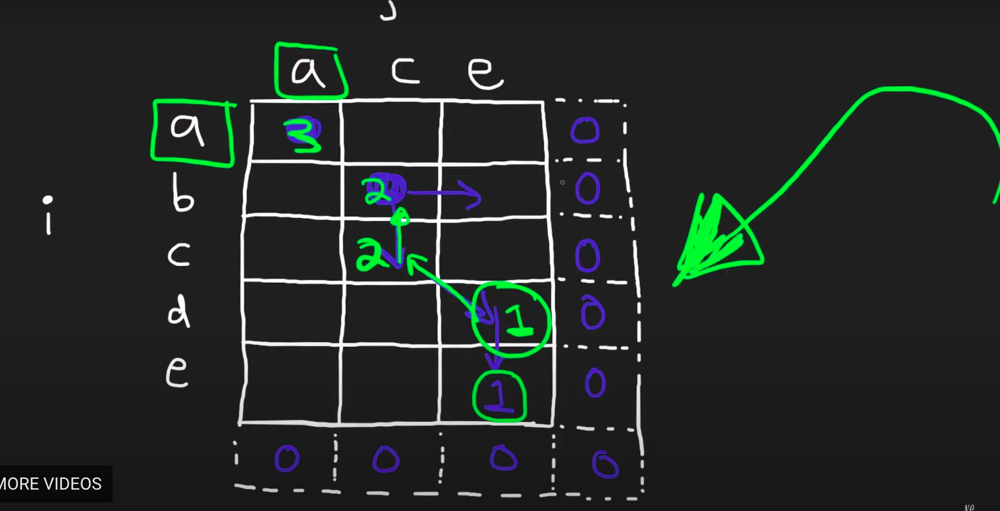
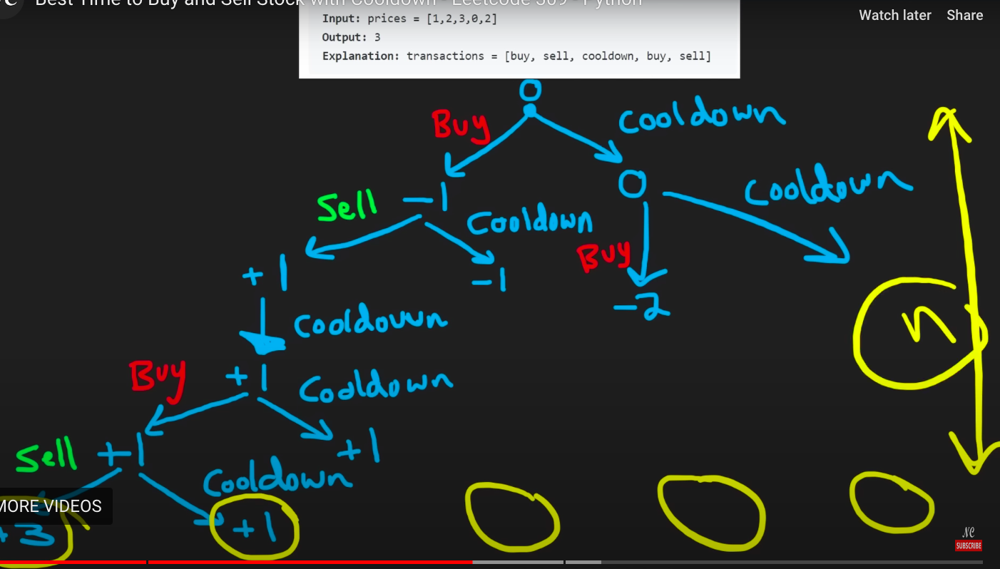

# Algorithm practice

# Week 09/18 - 09/24/2023

# Category for this week:
**[2D Dynamic Programming](#2d-dynamic-programming)**<br>

---

# 2D Dynamic Programming

## [Leetcode #1143 - Longest Common Subsequence](https://leetcode.com/problems/longest-common-subsequence/)

#### Level: Medium 📘



If go diagonally: +1
 
> Bottom up solution

```python
def longestCommonSubsequence(self, text1, text2):
  """
  :type text1: str
  :type text2: str
  :rtype: int

  if go diagnosely: +1
  """
  dp = [[0 for col in range(len(text2) + 1)] for row in range(len(text1) + 1)]

  # 2 conditions while iterating
  for r in range(len(text1) - 1, -1, -1):
    for c in range(len(text2) - 1, -1, -1):
      if text1[r] == text2[c]:
        dp[r][c] = 1 + dp[r + 1][c + 1]
      else:
        # value to the right and bot
        dp[r][c] = max(dp[r][c + 1], dp[r + 1][c])

  return dp[0][0]
```

#### O(text1 * text2) time | O(text1 * text2) space

## [Leetcode #309 - Best Time to Buy and Sell Stock with Cooldown](https://leetcode.com/problems/best-time-to-buy-and-sell-stock-with-cooldown/)

#### Level: Medium 📘



```python
def maxProfit(self, prices):
  """
  :type prices: List[int]
  :rtype: int

  instead of doing the whole recursion tree, use Caching/ dp
  """
  # State: Buying or Selling?
  # If Buy -> i + 1
  # If Sell -> i + 2

  dp = {}  # key=(i, canBuy) val=maxProfit

  def dfs(i, canBuy):
    if i >= len(prices):
      return 0
    if (i, canBuy) in dp:
      return dp[(i, canBuy)] # already at max value

    if canBuy:
      buy = dfs(i + 1, not canBuy) - prices[i]
      cooldown = dfs(i + 1, canBuy)
      dp[(i, canBuy)] = max(buy, cooldown) # caching
    else:
      sell = dfs(i + 2, not canBuy) + prices[i]
      cooldown = dfs(i + 1, canBuy)
      dp[(i, canBuy)] = max(sell, cooldown) # caching
    return dp[(i, canBuy)]

  return dfs(0, True)
```

#### O(2n) ~ O(n) time | O(2n) ~ O(n) space

## [Leetcode #518 - Coin Change II](https://leetcode.com/problems/coin-change-ii/)

#### Level: Medium 📘

```python
def change(self, amount, coins):
  """
  :type amount: int
  :type coins: List[int]
  :rtype: int
  """
  cache = {}

  def dfs(i, a):
    if a == amount:
      return 1
    if a > amount or i == len(coins):
      return 0
    if (i, a) in cache:
      return cache[(i, a)]
    
    cache[(i, a)] = dfs(i, a + coins[i]) + dfs(i + 1, a)
    return cache[(i, a)]
  
  return dfs(0, 0)
```

#### O(n * amount) time | O(n * amount) space

## [Leetcode #494 - Target Sum](https://leetcode.com/problems/target-sum/)

#### Level: Medium 📘

> Failed attempt - time limit exceeded
> Brute force

```python
def findTargetSumWays(self, nums, target):
  """
  :type nums: List[int]
  :type target: int
  :rtype: int
  """
  self.count = 0

  def dfs(i, total):
    if i == len(nums):
      if total == target:
        self.count += 1
      return
    dfs(i + 1, total + nums[i])
    dfs(i + 1, total - nums[i])
  
  dfs(0, 0)
  return self.count
```

#### O(2^n) time | O(1) space

> Success utilizing memorization - BACKTRACKING - calculations won't start until last element reached

```python
def findTargetSumWays(self, nums, target):
  """
  :type nums: List[int]
  :type target: int
  :rtype: int
  """
  # it really BACKTRACK - so memorization is important
  dp = {} # key: (index, total) | value: total number of ways

  def backtrack(i, total):
    if i == len(nums):
      return 1 if total == target else 0
    if (i, total) in dp:
      return dp[(i, total)]
    dp[(i, total)] = backtrack(i + 1, total + nums[i]) + backtrack(i + 1, total - nums[i])
    
    return dp[(i, total)]

  return backtrack(0, 0)
```

#### O(2n) time ~ O(n) time | O(2n) space ~ O(n) space

## [Leetcode #97 - Interleaving String](https://leetcode.com/problems/interleaving-string/)

#### Level: Medium 📘

> Recursive approach

```python
def isInterleave(self, s1, s2, s3):
  """
  :type s1: str
  :type s2: str
  :type s3: str
  :rtype: bool

  recursive solution
  """
  if len(s1) + len(s2) != len(s3):
      return False

  dp = {} # cache
  
  def dfs(i1, i2):
    # i3 = i1 + i2
    if i1 == len(s1) and i2 == len(s2):
      return True
    if (i1, i2) in dp:
      return dp[(i1, i2)]

    if i1 < len(s1) and s1[i1] == s3[i1 + i2] and dfs(i1 + 1, i2):
      return True
    if i2 < len(s2) and s2[i2] == s3[i1 + i2] and dfs(i1, i2 + 1):
      return True
    dp[(i1, i2)] = False
    return False
  
  return dfs(0, 0)
```

#### Worst: O(2^(n1 + n2)) -> but we can take advantage of caching to keep O(n1 * n2) time

> There is another approach using DP
